# Q & A App using React.js & Django REST Framework
##### By Alejandro Spara Dominguez
 
##### This project was developed for the fifth project with the Code Institute and the Full Stack Development Course.
 
##### [Click here to view the deployed front end app.](https://stack-react.herokuapp.com/)
##### [Click here to view the deployed back end app.](https://stack-drf-api.herokuapp.com/)
 
##### [Click here to view the repository for the front end of the application.](https://github.com/AlexSD92/stack_react)
##### [Click here to view the repository for the back end of the application.](https://github.com/AlexSD92/stack_drf_api)
 
 
 
# Table of Contents:
 
1. [Why](#Why)
    1. [Project Goals](#project-goals)
2. [User Experience (UX)](#user-experience-UX)
    1. [Target Audience](#target-audience)
    2. [User Stories](#user-stories)
    3. [Strategy](#strategy)
    4. [Scope](#scope)
        1. [Components](#components)
    5. [Skeleton](#skeleton)
    6. [Surface](#surface)
        1. [Typography](#typography)
    7. [Structure](#structure)
3. [Features](#features)
    1. [Current Features](#current-features)
    2. [Future Features](#future-features)
4. [Technologies](#technologies)
    1. [Languages](#languages)
    2. [Frameworks](#frameworks)
    3. [Other Technologies and Libraries](#other-technologies-and-libraries)
5. [Testing and Development](#testing-and-development)
    1. [Frontend](#frontend)
    2. [Backend](#backend)
    3. [Bugs](#bugs)
6. [Deployment](#deployment)
    1. [Cloning and Forking the GitHub Repository](#cloning-and-forking-the-github-repository)
    2. [Local Deployment](#local-deployment)
    3. [Remote Deployment](#remote-deployment)
7. [Credits](#credits)
 
 
 
# Why

The purpose of this project is to create a question and answer application. 

### Project Goals

- Enable users to interact with one another by posting questions and answers. 
    - Addressed by user stories 7, 8, 9, & 10
- Protect community integrity by preventing users from editing or deleting other user questions and answers.
    - Addressed by user stories 11, 12, 13, 14, 15, 16, 17 & 18
- Protect user integrity through authentication and authorisation.
    - Addressed by user stories 1, 2, 3, 4, 5 and 6
- Provide users a sense of identity and also give them the option to disclose information about themselves.
    - Addressed by user stories 19, 20 & 22
- Encourage users to learn about other users that they have seen answering or posting questions by giving them the ability to view profiles.
    - Addressed by user story 21
- Avoid creating an environment that allows users to post questions that are uninfluenced by the website design by producing a minimalist unimposing style.
    - Addressed by user story 23
- Create a low learning curve to enable a larger demographic to quickly understand how to use the website and participate in the community.
    - Addressed by user story 23
- Separation of concerns.
    - Addressed by user stories 24, 25, 26, 27, 28 and 29

 
 
# User Experience
 
### Target Audience
 
This app is aimed at a general audience.
- Anyone that would like to ask a question about something.
- Anyone that feels like they could answer questions that have been asked.
 
### User Stories
 
##### Navigation & Authentication
1. As a user, I can register for an account so that I may use the platform.
2. As a user, I can log in to my account so that I may use the platform.
3. As a user, I can log out of my account so that I may end my session.
4. As a user, I am unable to post questions unless I am logged in.
5. As a user, I am unable to post answers unless I am logged in.
6. As a user, I am unable to view my profile unless I am logged in.
 
##### Questions & Answers
7. As a user, I can post questions so that I may receive answers.
8. As a user, I can update my own questions so that I may correct errors or make them clearer.
9. As a user, I can delete my own questions so that I may remove the questions I no longer need answered.
10. As a user, I can post answers to questions so that I may be helpful to other users.
11. As a user, I can update my own answers so that I may correct errors or make them clearer.
12. As a user, I can delete my own answers so that I may remove answers that are incorrect.
13. As a user, I am unable to update other user questions.
14. As a user, I am unable to delete other user questions.
15. As a user, I am unable to update other users' answers.
16. As a user, I am unable to delete other users' answers.
17. As a user, I can view a list of questions so that I may see what questions have been asked.
18. As a user, I can view a list of answers so that I may see what answers have been given.
 
##### Profile
19. As a user, I can access my profile so that I may view my information.
20. As a user, I can update my details so that I may keep my information up to date.
21. As a user, I can view other user profiles so I may learn more about them.
22. As a user, I am unable to edit other user profiles.
 
### Strategy
 
23. Create a simple question and answer app where users are able to login/out and post questions and answers.
24. Split the frontend and backend to reduce development issue risks, such as breaking the entire website with single lines of code.
25. Split the frontend and backend to facilitate relatively easier debugging.
26. Split the frontend and backend to take advantage of the modularity that both React.js and DJRest have to offer.
27. Split the frontend and backend to be able to drastically edit the UX and UI without needing to change or impact the stability of the business logic or backend.
28. Develop the front end using React.js because of its flexibility and scalability.
29. Develop the backend using DJRest because of its flexibility and scalability.
 
##### Components
 
- The application is largely divided up into 3 major sections.
    1. Questions
    2. Answers
    3. Profiles
 
- In any regard, authentication and authorisation play a large role in how the application works.
    1. The questions section contains 2 central components by which the other components interact with.
        - QuestionList.js lists all questions in the database in order of newest to oldest.
            - Within QuestionList.js, users may find the NewQuestionForm.js component if they are logged in.
        - QuestionEditOrDetail.js is the detail view for the questions section.
            - If a user is logged in and they select their own question, the default component will be EditQuestionForm.js, otherwise it will be QuestionDetail.js.
            - Furthermore, if the user is logged in and they select a question, they will be able to add answers to the question they have selected; if they are not logged in, they will be unable to add any answers.
    2. The answers and profiles sections follow the same logic as the questions section in terms of what a user is allowed to edit and when they are allowed to edit.
        - In general, if a user is logged in and they select their own question, answer or profile, the component that will be returned is the Question/Answer/Profile/EditOrDetail.js component.
        - If they are not logged in, the component that will be returned is the Question/Answer/Profile/Detail.js component.
        - In order to post new Questions or Answers, users must be logged in.
    3. The only component that is applied to the entire project is the NavBar.js component.
 
### Scope
 
- Log in and out.
- Create, update and delete questions.
- Create, update and delete answers.
- Manage user profiles.
- Update and delete restricted to owner.
 
### Skeleton
 
Wireframes for the project can be found within the assets directory of this repository.
 
### Surface
 
##### Typography
 
The following were used from Google Fonts:
- font-family: 'Aref Ruqaa Ink', serif: for app logo
- font-family: 'Roboto Slab', serif: for headings
- font-family: 'Source Sans Pro', sans-serif: for all other text
 
 
 
# Features
 
### Current Features
- Log in/out
    - Log in will be a standard form requiring a username and password field, as well as a button to submit the form.
    - Log out will appear as a link to authenticated users within the navbar.
    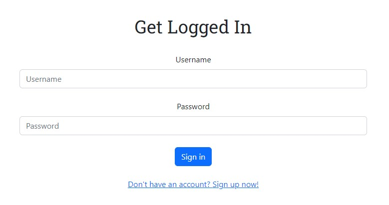
  
- Register for an account
    - Register will be a standard form requiring a username, email, password1 and password2 fields, as well as a button to submit the form.
    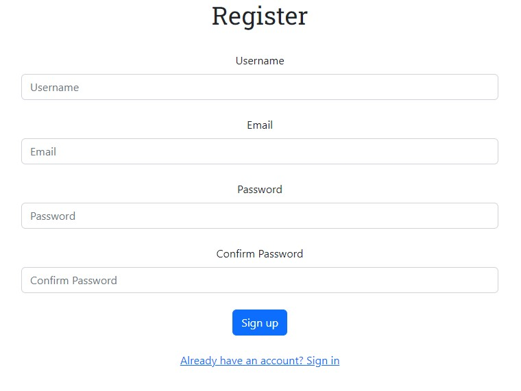
  
- Post a new question
    - A button will be present for users to be directed to a new question form.
    - The new question form will be a standard form requiring a summary and question field, as well as a button to submit the form.
    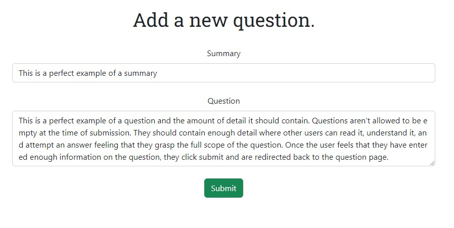
  
- Post an answer to a question
    - A button will be present for users to be directed to a new answer form.
    - The new answer form will be a standard form requiring an answer field, as well as a button to submit the form.
    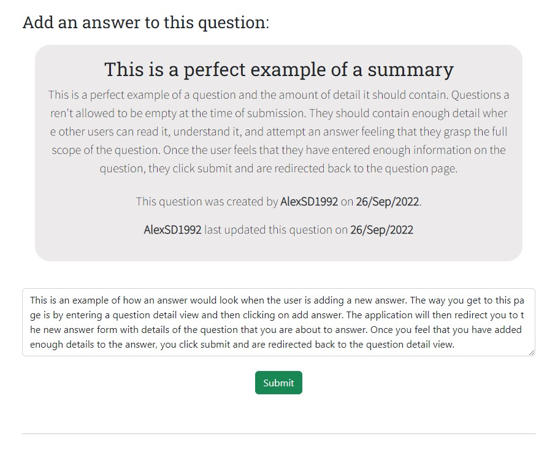
  
- Edit an existing question if you are the author
    - A button will be present within the question detail view for users to be directed to an edit question form.
    - The edit question form will be a standard form requiring a summary and question field, as well as a button to submit the form or delete the question.
    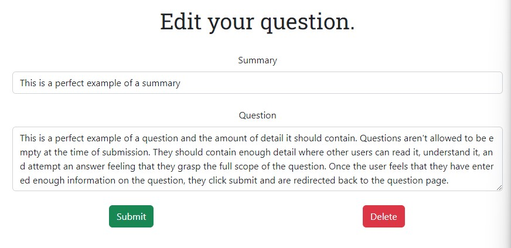
  
- Edit an existing answer if you are the author
    - A button will be present within the answer detail view for users to be directed to an edit answer form.
    - The edit answer form will be a standard form requiring an answer field, as well as a button to submit the form or delete the answer.
    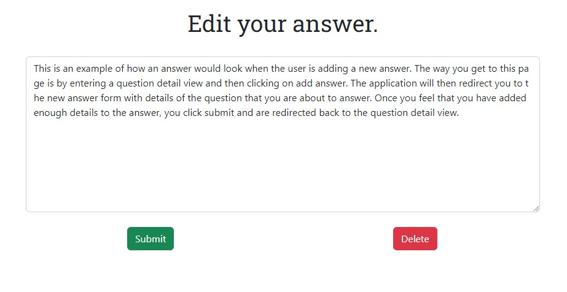
  
- Edit your profile
    - A button will be present within the profile detail view for users to be directed to an edit profile form.
    - The edit profile form will be a standard form requiring a name and bio field, as well as a button to submit the form.
    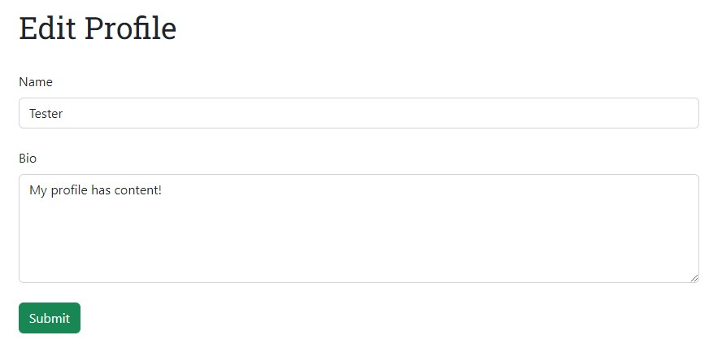
  
- Question and answer list view
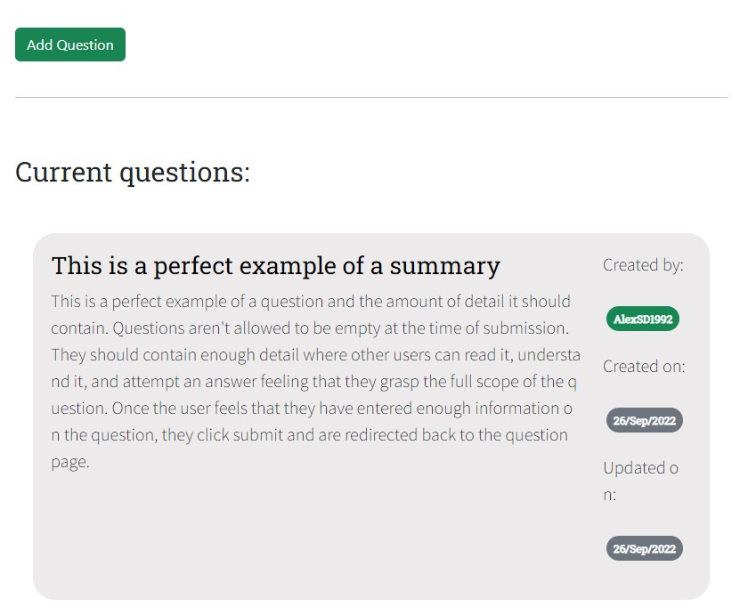
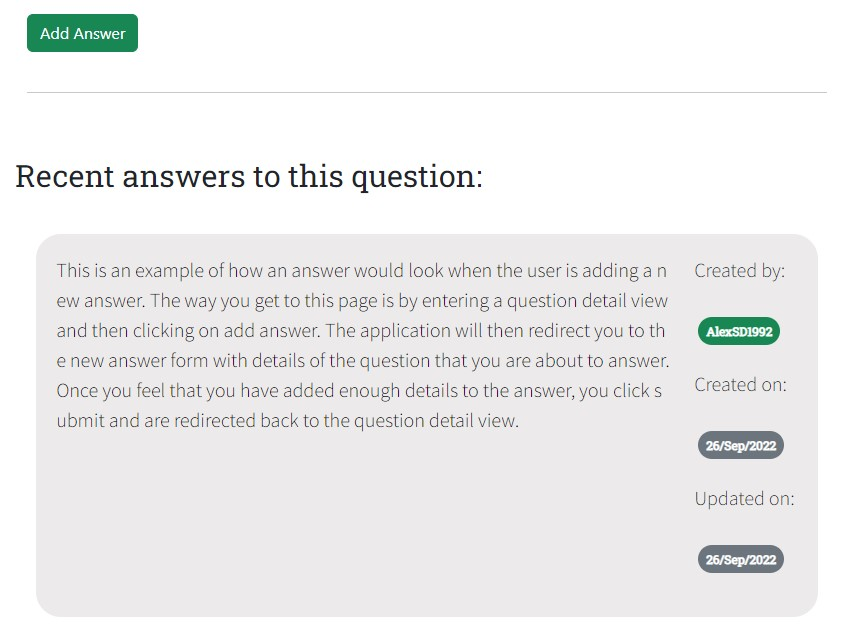
  
- Question and answer detail view
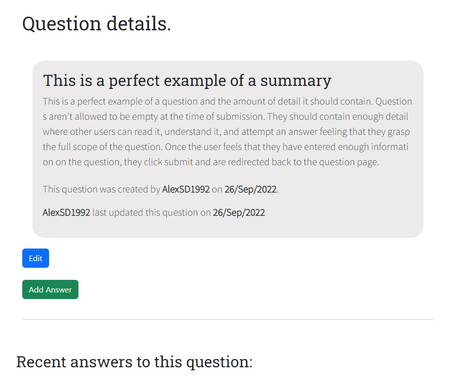
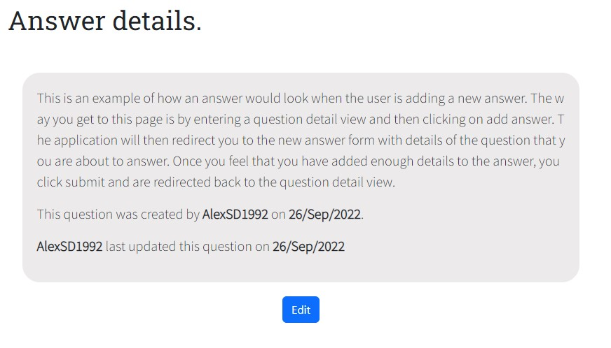
 
### Future Features
- Statistics on platform usage
    - For example, how many questions a user has asked versus answered
- Additional authentication options, such as logging in with social media
- A direct messaging system to contact other users directly
- Additional profile features such as images
- Ability to upvote and downvote questions and answers in order to provide better visibility on the best questions and answers
- Pagination
- Search feature
- Filter feature
- Profile images
- Breadcrumbs
 
 
 
# Technologies
### Languages
 
- [Python](https://www.python.org/)
- [HTML](https://www.w3schools.com/html/)
- [CSS](https://www.w3schools.com/css/)
- [SQL](https://www.w3schools.com/sql/)
- [JavaScript](https://www.w3schools.com/js/)
- [JSX](https://www.w3schools.com/react/react_jsx.asp)
 
### Frameworks
 
- [Django](https://www.djangoproject.com/)
- [Django REST](https://www.django-rest-framework.org/)
- [React](https://reactjs.org/)
 
### Other Technologies and Libraries
 
- [Psycopg2-Binary](https://pypi.org/project/psycopg2-binary/)
- [Whitenoise](http://whitenoise.evans.io/en/stable/)
- [Heroku](https://id.heroku.com/)
- [Heroku Postgres](https://www.heroku.com/postgres)
- [Gunicorn](https://gunicorn.org/)
- [React Router](https://v5.reactrouter.com/)
    - Often recommended by users of stack-exchange.
    - Documentation that is easy to understand.
- [Bootstrap React](https://react-bootstrap.github.io/)
    - One of the oldest React libraries available.
    - Familiarity with Bootstrap made this an easy and accessible choice.
- [dj-rest-auth](https://dj-rest-auth.readthedocs.io/)
- [JWT](https://jwt.io/)
- [Axios](https://axios-http.com/)
- [Django Allauth](https://django-allauth.readthedocs.io/)
- [Django CORS Headers](https://pypi.org/project/django-cors-headers/)
 
 
 
# Testing and Development
 
### Frontend
 
Test | Steps | Working As Intended (Y / N)
--- | --- | :---:
Log In | 1. User clicks log in on the nav bar.   2. User inputs a valid username in the username field.   3. User inputs a valid password in the password.   4. User clicks log in.   5. User is redirected to the home page. | Yes
Register | 1. User clicks register on the nav bar.   2. User inputs a unique and valid username in the username field.   3. User inputs a unique and valid email in the email field.   4. User inputs a valid password in the password1 field.   5. User confirms the password from the password1 field in the password2 field.   6. User clicks register.   7. User is redirected to the login page. | Yes
Log Out | 1. User is authenticated.   2. User clicks log out on the nav bar.   3. User is redirected to the login page. | Yes
New Question | 1. User is authenticated.   2. User clicks questions on the nav bar and is directed to the question list page.   3. User clicks on add question and is redirected to the add a new question page.   4. User inputs a valid summary.   5. User inputs a valid question.   6. User clicks submit and is redirected to the question list page where they can view their newly posted question. | Yes
Edit or Delete Question | 1. User is authenticated   2. User clicks questions on the nav bar and is directed to the question list page.   3. User clicks on an existing question that they are an author of and is redirected to the detailed view of that question.   4. User clicks on edit and is redirected to the edit view where they are given the option between submitting an edit or deleting the question.   6. User edits summary and question fields and clicks submit and is redirected to the detail view for that question.   7. If a user clicks delete, they are redirected to the delete page where they are asked to confirm whether they really want to delete the question or return to safety.   8. Clicking return to safety brings the user back to the edit view.   9. Clicking delete deletes the question and brings the user to the question list page.
New Answer | 1. User is authenticated.   2. User clicks questions on the nav bar and is directed to the question list page.   3. Users click on an existing question and they are redirected to the detail view for that question.   4. User clicks on add answer and they are directed to the new answer page.   5. Users add their answer content to the answer field and clicks submit, they are then redirected to the question detail view. | Yes
Edit or Delete Answer | 1. User is authenticated.   2. User clicks questions on the nav bar and is directed to the question list page.   3. Users click on an existing question and they are redirected to the detail view for that question.   4. User clicks on an answer within the question detail view page that they are an author of and they are redirected to the detail view for that answer.   5. Users click on edit and they are brought to the edit view for that answer where they are given the choice to submit the edit or delete.   6. User updates the answer and clicks submit where they are redirected to the answer detail view.   7. If the user clicks delete, they are redirected to the delete page where they are asked to confirm whether they really want to delete the answer or return to safety.   8. Clicking return to safety brings the user back to the edit view.   9. Clicking delete deletes the answer and brings the user back to the question detail page. | Yes
Edit Profile | 1. User is authenticated.   2. Users either find their profile in the listview or click on their username in the navbar where they are brought to a detailed view of their profile.   3. Users click edit within the detail view and they are brought to the edit view for their profile.   4. User inputs valid data and clicks submit and they are redirected back to the detail view. | Yes
CRUD | Create, update and delete functionality in place across accounts, contacts and opportunities | Yes
Responsiveness | All components collapse into mobile view | Yes
Authentication | Users must be logged in to post new questions and answers. Error messages are displayed otherwise. | Yes
Authorisation | Users must be logged in to edit and delete their own questions and answers | Yes
Authorisation | Users are unable to edit or delete other user questions and answers | Yes
 
### Backend
 
Test | Desired Functionality | Working As Intended (Y / N)
--- | --- | :---:
Log In | Incorrect input results in an error message. Correct input logs the user in | Yes
Register | Accounts cannot be created with existing usernames. Successful registration results in message telling user to contact administrator | Yes
Log Out | When a user clicks log out, they are redirected to the log out page and must log in again | Yes
URLs | All URLs work as intended and redirect users to correct pages | Yes
CRUD | Create, update and delete functionality in place across accounts, contacts and opportunities | Yes
Profile | Profile is accessible and users can update their name and bio | Yes
Responsiveness | All components collapse into mobile view | Yes
Authentication | Users must be logged in to post new questions and answers | Yes
Authorisation | Users must be logged in to edit and delete their own questions and answers | Yes
Authorisation | Users are unable to edit or delete other user questions and answers | Yes
 
### Bugs
 
- EditQuestionForm and AnswerQuestionForm successfully PUSH to the API, but upon navigating back to the QuestionDetail component or AnswerDetail component, they do not always GET the updated question or answer and they require an additional page refresh.
 
- Throughout the application, when a user is authenticated, warning messages appear for a split second as pages load. This is due to the way the application is designed whereby pages that require authentication check for user presence before displaying any content.
 
- Very rarely, when a user is not authenticated and is viewing unprotected content, the application directs the unauthenticated user to the login page. This typically happens during a refresh and it isn't very clear why this is happening.
 
- Within components that have nested components that make multiple GET, PUT or PUSH requests to the API, the application apparently submits data and there are no errors, but data isn't submitted. This rarely happens.
 
- While the edit views are loading data and the forms are empty, the alerts appear handling exceptions stating that the forms cannot be submitted. Once the forms load, the alerts disappear.
 
 
 
# Deployment
### Cloning and Forking the GitHub Repository
 
In order to make changes to this code without affecting the original code, you must fork the repository. This means that you will be given a copy of the code for that moment in time. In order to do this, you must:
 
1. Create a GitHub account (if you have one already, skip this step).
2. Navigate to the repository.
    - [Front End](https://github.com/AlexSD92/stack_react)
    - [Back End](https://github.com/AlexSD92/stack_drf_api)
3. Near the top right, click 'Fork'.
4. A copy of the repository will be available for you to use within your own remote repository.
 
In order to clone the repository, you must:
 
1. Create a GitHub account (if you have one already, skip this step).
2. Navigate to the repository you would like to clone.
    - [Front End](https://github.com/AlexSD92/stack_react)
    - [Back End](https://github.com/AlexSD92/stack_drf_api)
3. Near the top, select 'Code' in the dropdown.
4. Copy the HTTPS address.
5. Navigate to the directory where you would like to create a new directory using the terminal.
    - Use the pwd command to know where you currently are.
    - Use cd followed by the directory name to change directories.
    - use mkdir followed by a new directory name to create a new directory.
6. Enter:
    - Front End: 'https://github.com/AlexSD92/stack_react.git'
    - Back End: 'https://github.com/AlexSD92/stack_drf_api.git'
7. The repository will be cloned into your chosen directory.
 
### Local Deployment
 
##### Front End
 
1. Create a new folder in your preferred IDE.
    - If you would like to copy this project exactly, use GitPod.
2. Give your folder a project name, for example '*stack-react*'.
3. Open up your terminal.
4. First and foremost, install Django by typing 'npx create-react-app . --use-npm', and wait for the installation to finish.
5. Install the following using 'npm install':
    - react-bootstrap
    - react-router-dom
    - axios
6. In the command terminal, start the app by typing 'npm start'.
7. Your project should be deployed locally.
 
##### Back End
 
1. Create a new folder in your preferred IDE.
    - If you would like to copy this project exactly, use GitPod.
2. Give your folder a project name, for example 'stack-drf-api'.
3. Open up your terminal.
4. First and foremost, install Django by typing '*pip install Django*', and wait for the installation to finish.
5. Time to start the project, so type '*django-admin startproject [insert your project name here]*' and wait for the folders and files to be created.
6. Install the following dependencies using 'pip install':
    - django-rest-framework
    - django-cors-headers
    - django-allauth
    - dj-rest-auth
    - psycopg2
    - gunicorn
    - dj-database-url
    - whitenoise
7. In your terminal, type '*python manage.py runserver*'
8. Your project should be hosted locally.
9. You should view the following message 'The install worked successfully! Congratulations!'.
 
### Remote Deployment
 
##### Front End
 
1. Create a new folder in your preferred IDE.
    - If you would like to copy this project exactly, use GitPod.
2. Give your folder a project name, for example '*stack-react*'.
3. Open up your terminal.
4. First and foremost, install Django by typing 'npx create-react-app . --use-npm', and wait for the installation to finish.
5. Install the following using 'npm install':
    - react-bootstrap
    - react-router-dom
    - axios
6. Create a Heroku account if you don't have one already.
7. Click on Create new app.
8. Give your app a name, choose your region and click create.
9. Click on Deploy and click on 'Deploy Branch' at the bottom of the page after connecting to your GitHub account.
10. Because the app was created using npm, it should already have all the dependencies it requires for a successful Heroku deployment.
 
##### Back End
 
1. Create a new folder in your preferred IDE.
    - If you would like to copy this project exactly, use GitPod.
2. Give your folder a project name, for example 'stack-drf-api'.
3. Open up your terminal.
4. First and foremost, install Django by typing '*pip install Django*', and wait for the installation to finish.
5. Time to start the project, so type '*django-admin startproject [insert your project name here]*' and wait for the folders and files to be created.
6. Install the following dependencies using 'pip install':
    - django-rest-framework
    - django-cors-headers
    - django-allauth
    - dj-rest-auth
    - psycopg2
    - gunicorn
    - dj-database-url
    - whitenoise
7. Create your *.gitignore* and include:
    - *.log
    - *.pot
    - *.pyc
    - __pycache__/
    - local_settings.py
    - *.sqlite3
    - media
    - .env
    - .venv
    - env/
    - venv/
    - ENV/
    - env.bak/
    - venv.bak/
8. Create a GitHub account if you don't already have one.
9. Create a new repository by clicking the green button labelled as *New*, and name your repo the same as you named your project locally for consistency.
10. Decide whether you want the repo to be either public or private.
11. Don't select to initialise your repository with any starting files, you can create these later on and push them to the repo.
12. Click the green *Create repository* button.
13. On your command line, execute the following:
    1. *git init*
    2. *git add .*
    3. *git commit -m "Initial commit"*
    4. *git branch -M main*
    5. *git remote add origin [insert your SSH link]*
        - Your SSH link should look something like 'https://github.com/AlexSD92/stack_drf_api.git'
    6. *git push -u origin main*
14. Your local files are now linked to your github repository and from here on out, you only need to use the add, commit and push commands to update your repo.
15. Create an account if you don't already have one.
16. Click on create a new app.
17. Give your app a name, choose your region and click create.
18. Click on the 'Resources' tab first.
    - Under Add-ons, search and select 'Heroku Postgres'.
    - Select your plan name, most likely 'Hobby Dev - Free'.
    - Then click 'Submit Order Form'
19. Next head to your settings and click on 'Reveal Config Vars'.
    - Notice that Heroku has created a 'DATABASE_URL' for use later.
    - Include requirements.txt as a key and copy all of the contents of your requirements.txt into the value field.
    - Within your project folder and in the settings.py file, you should find a 'SECRET_KEY'. Include this as a key and the secret key as the value. You can edit this to be whatever you like, just be sure to include it in your Config vars.
    - Finally, for development, you will need to disable the collection of static files. The file key value pair you need to add is 'DISABLE_COLLECTSTATIC=1'.
20. Click on 'Add Buildpack' and select python, then 'Save changes'.
25. At the top of your settings.py file, '*import os*' and '*import dj_database_url*'.
26. Ensure DEBUG is set to True for development purposes or False for production.
27. Set your 'ALLOWED_HOST' to ['[*your heroku project name*].herokuapp.com']. For example, 'ALLOWED_HOSTS = ['stack-drf-api.herokuapp.com']
28. Comment out the existing database and include a new DATABASE setting.
    - Go back to your Heroku config vars and grab the DATABASE_URL key value.
    - Include it as your new DATABASE setting. For example:
    DATABASE = {
        'default': dj_database_url.parse('insert DATABASE_URL KEY VALUE'),
    }
29. In your terminal, type '*python manage.py migrate*'.
    - You should see all migrations with a green OK status.
30. Collect you static files by setting:
    - STATIC_ROOT = os.path.join(BASE_DIR, 'static')
    - STATICFILES_STORAGE = 'whitenoise.storage.CompressedManifestStaticFilesStorage'
31. Also list:
    - 'whitenoise.middleware.WhiteNoiseMiddleware', within MIDDLEWARE' under django.middleware.security.SecurityMiddleware' in settings.py    
    - 'whitenoise.runserver_nostatic', within INSTALLED_APPS in settings.py
32. Head back to Heroku and click on the 'Deploy' tab.
33. Select your 'Deployment method' as 'GitHub'.
    - Follow the prompts to link your GitHub account.
    - Search for the repository you created.
    - Click 'Connect'.
34. Head down to the 'Manual deploy' section and click on 'Deploy Branch'.
35. Wait for Heroku to build your app and then open your app.
36. You should view the following message 'The install worked successfully! Congratulations!'.
 
 
 
# Credits
1. [The Django Documentation](https://docs.djangoproject.com/en/4.0/)
    - For the details of how django works.
 
2. [The Django REST Documentation](https://www.django-rest-framework.org/)
 
3. [W3Schools](https://www.w3schools.com/)
    - For their Django and React tutorials
 
4. [Stack Overflow](https://stackoverflow.com/)
    - Amazing forums with great and detailed discussions demonstrating how to write code and why it should be written that way.
 
5. [Code Institute](https://codeinstitute.net/)
    - For their learning platform and support.
    - Their code on axiosDefaults.js and creating user context.
    - Their examples on forms and handling user interactions.

